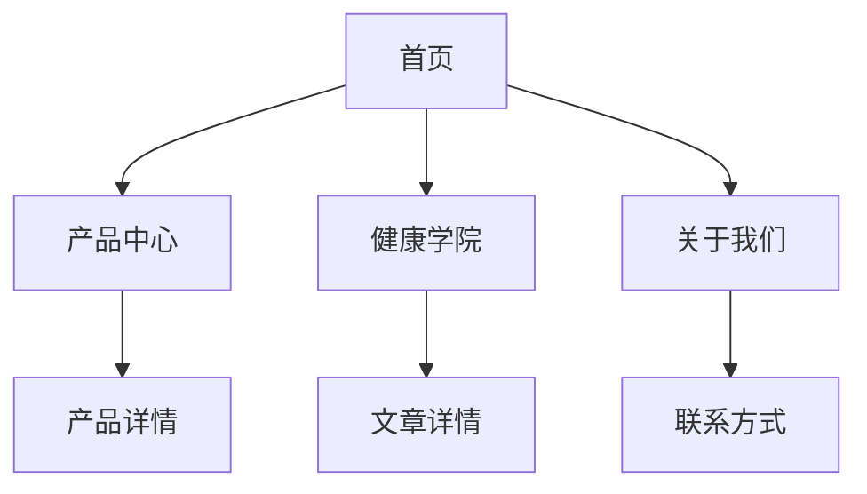

## 1. 产品概述
迷迭尔是一家专注于低GI和控糖食品的企业，提供生酮食品和各类零糖常态化食品。网站旨在增强品牌形象，向消费者展示产品的控糖功能，并提供科学的低糖饮食健康知识教育。

目标用户关注健康饮食、控糖需求的消费者，以及寻找高品质低糖食品的群体。通过专业内容建立品牌信任度，促进产品销售。

## 2. 核心功能

### 2.1 用户角色
本网站为品牌展示型网站，无需用户注册登录功能。所有访客均可浏览全部内容。

### 2.2 功能模块
网站包含以下核心页面：
1. **首页**：品牌故事、产品亮点、营养价值展示
2. **产品中心**：生酮食品、零糖蛋糕、零糖青团、零糖大饼分类展示
3. **健康学院**：低糖饮食知识、控糖科普文章
4. **关于我们**：企业发展历程、品牌理念、联系方式

### 2.3 页面详情
| 页面名称 | 模块名称 | 功能描述 |
|---------|---------|---------|
| 首页 | 英雄区域 | 展示品牌标语、核心产品图片、立即了解按钮 |
| 首页 | 产品亮点 | 轮播展示主打产品、营养成分对比图 |
| 首页 | 品牌价值 | 展示企业使命、控糖理念、品质承诺 |
| 产品中心 | 分类导航 | 生酮食品、零糖蛋糕、零糖青团、零糖大饼分类筛选 |
| 产品中心 | 产品列表 | 展示产品图片、名称、主要特点、营养成分 |
| 产品中心 | 产品详情 | 大图展示、详细描述、营养成分表、食用建议 |
| 健康学院 | 知识分类 | 低糖饮食原则、控糖技巧、健康食谱分类 |
| 健康学院 | 文章列表 | 科普文章标题、摘要、发布时间展示 |
| 健康学院 | 文章详情 | 完整文章内容、相关推荐、分享功能 |
| 关于我们 | 企业简介 | 企业发展历程、品牌故事、核心价值观 |
| 关于我们 | 联系我们 | 企业地址、客服电话、工作时间、地图位置 |

## 3. 核心流程
访客访问网站的主要流程：
1. 通过搜索引擎或直接输入网址进入首页
2. 浏览英雄区域了解品牌定位和核心产品
3. 点击产品分类查看具体产品信息
4. 阅读健康学院文章了解低糖饮食知识
5. 通过关于我们页面了解企业背景并联系咨询

## 4. 用户界面设计

### 4.1 设计风格
- **主色调**：自然绿色系（鼠尾草绿 #87A96B、森林绿 #4A5D3A）
- **辅助色**：温暖米色（#F5F1E6、#E8DCC0）
- **强调色**：健康橙色（#E8B781）用于按钮和重要元素
- **按钮样式**：圆角矩形，悬停时有轻微阴影效果
- **字体**：思源黑体为主，标题使用较粗字重，正文字体大小16px
- **布局风格**：卡片式布局，顶部导航栏固定
- **图标风格**：使用线性图标，简洁现代风格

### 4.2 页面设计概览
| 页面名称 | 模块名称 | UI元素 |
|---------|---------|--------|
| 首页 | 英雄区域 | 全屏背景图使用新鲜食材照片，品牌标语居中显示，CTA按钮使用强调色 |
| 首页 | 产品亮点 | 横向卡片布局，每张卡片包含产品图、名称、简短描述，悬停时有上浮动画 |
| 产品中心 | 分类导航 | 顶部标签式导航，当前选中状态使用主色调背景 |
| 产品中心 | 产品列表 | 网格布局，每行3-4个产品卡片，包含价格标签和营养标识 |
| 健康学院 | 文章列表 | 左侧分类侧边栏，右侧文章列表采用时间倒序排列 |
| 关于我们 | 企业简介 | 时间轴形式展示发展历程，配以相关图片 |

### 4.3 响应式设计
- 采用桌面优先设计，确保大屏幕展示效果最佳
- 平板设备：调整网格布局为每行2个产品
- 手机端：采用单列布局，导航栏变为汉堡菜单
- 所有交互元素适配触摸操作，按钮最小点击区域44px
- 图片采用响应式加载，移动端加载较小尺寸图片提升性能

### 4.4 内容规范
- 所有健康相关内容需符合广告法要求，避免使用治疗、治愈等敏感词汇
- 营养声明需有科学依据支持，标注数据来源
- 产品描述突出"低GI"、"零添加糖"、"生酮友好"等合规卖点
- 健康建议采用"有助于"、"可能帮助"等温和表述方式