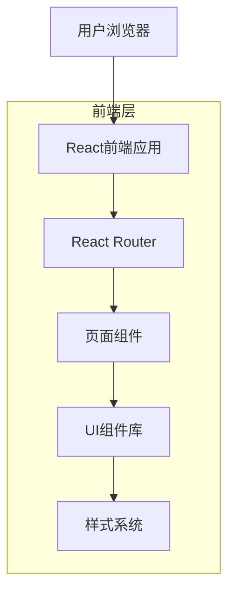

## 1. 架构设计



## 2. 技术描述

- **前端框架**: React@18 + Vite
- **样式方案**: Tailwind CSS@3 + PostCSS
- **UI组件库**: shadcn/ui + Radix UI
- **图标库**: Lucide React
- **初始化工具**: vite-init
- **包管理**: pnpm
- **代码规范**: ESLint + Prettier

### 核心依赖包
```json
{
  "dependencies": {
    "react": "^18.2.0",
    "react-dom": "^18.2.0",
    "react-router-dom": "^6.8.0",
    "lucide-react": "^0.263.0",
    "clsx": "^2.0.0",
    "tailwind-merge": "^1.14.0"
  },
  "devDependencies": {
    "@types/react": "^18.2.15",
    "@types/react-dom": "^18.2.7",
    "@vitejs/plugin-react": "^4.0.3",
    "autoprefixer": "^10.4.14",
    "postcss": "^8.4.27",
    "tailwindcss": "^3.3.3",
    "vite": "^4.4.5"
  }
}
```

## 3. 路由定义

| 路由路径 | 页面组件 | 功能描述 |
|---------|---------|---------|
| / | HomePage | 首页，展示品牌故事和产品亮点 |
| /products | ProductsPage | 产品中心，分类展示所有产品 |
| /products/:category | CategoryPage | 具体分类产品列表 |
| /products/:category/:id | ProductDetailPage | 产品详情页 |
| /health | HealthPage | 健康学院首页 |
| /health/:category | HealthCategoryPage | 健康知识分类 |
| /health/article/:id | ArticlePage | 文章详情页 |
| /about | AboutPage | 关于我们页面 |
| /contact | ContactPage | 联系方式页面 |

## 4. 组件架构

### 4.1 布局组件
- **Header**: 顶部导航栏，包含logo、主导航菜单
- **Footer**: 底部信息，包含联系方式、社交媒体链接
- **Layout**: 统一页面布局容器

### 4.2 通用组件
- **Button**: 统一按钮样式，支持多种变体
- **Card**: 卡片容器，用于产品展示
- **Badge**: 标签组件，显示营养标识
- **NavigationMenu**: 响应式导航菜单
- **MobileMenu**: 移动端汉堡菜单

### 4.3 业务组件
- **HeroSection**: 首页英雄区域
- **ProductCard**: 产品卡片组件
- **ProductGrid**: 产品网格布局
- **ArticleCard**: 文章卡片组件
- **NutritionInfo**: 营养信息展示
- **CategoryFilter**: 分类筛选组件

## 5. 状态管理

### 5.1 组件状态
- 使用React useState管理组件内部状态
- 使用useEffect处理副作用和生命周期

### 5.2 全局状态
- 使用React Context管理主题、语言等全局状态
- 产品数据通过props逐层传递

## 6. 性能优化

### 6.1 代码分割
- 按路由进行代码分割
- 动态导入大型组件

### 6.2 图片优化
- 使用WebP格式图片
- 响应式图片加载
- 图片懒加载实现

### 6.3 缓存策略
- 静态资源长期缓存
- 组件级别memo优化

## 7. 开发规范

### 7.1 文件结构
```
src/
├── components/          # 通用组件
│   ├── ui/           # 基础UI组件
│   ├── layout/       # 布局组件
│   └── common/       # 业务组件
├── pages/            # 页面组件
├── hooks/            # 自定义Hook
├── utils/            # 工具函数
├── styles/           # 样式文件
├── assets/           # 静态资源
└── constants/        # 常量定义
```

### 7.2 命名规范
- 组件使用PascalCase命名
- 文件和文件夹使用kebab-case命名
- CSS类使用tailwind原子类

### 7.3 响应式设计
- 移动端优先的CSS编写方式
- 断点设置：sm(640px)、md(768px)、lg(1024px)、xl(1280px)
- 触摸事件优化

## 8. 部署配置

### 8.1 构建配置
- Vite生产环境优化
- 资源压缩和混淆
- 生成source map用于调试

### 8.2 环境变量
- 开发环境和生产环境分离
- 敏感信息通过环境变量配置

### 8.3 CDN配置
- 静态资源CDN加速
- 域名配置和HTTPS支持